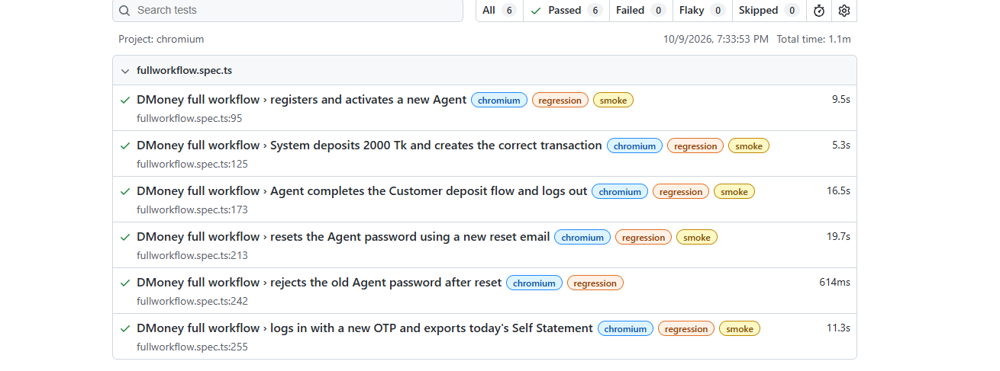
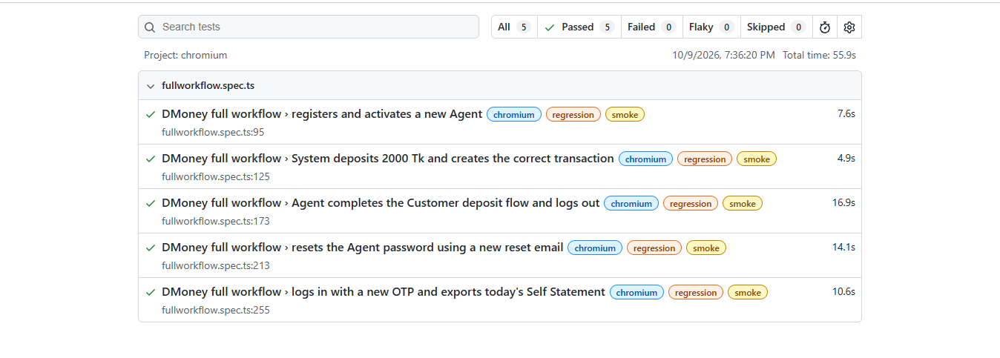

# DMoney Playwright Automation

End-to-end test automation for the DMoney web application using Playwright and TypeScript. The workflow covers Agent registration and activation, System-to-Agent deposit, Agent-to-Customer deposit, Gmail OTP and password reset, transaction validation, and Self Statement CSV export.

## Test Coverage

- Register a new Agent and verify the pending status
- Activate the Agent from the Admin portal
- Verify that the active status remains after a page reload
- Deposit BDT 2,000 from the System account to the Agent
- Validate the System-to-Agent transaction and Agent balance
- Deposit BDT 500 from the Agent account to an existing Customer
- Validate the updated balance and Self Statement
- Reset the Agent password using the Gmail reset email
- Verify that the old password is rejected
- Log in with the new password and a fresh Gmail OTP
- Export the current day's Self Statement to CSV

## Project Structure

```text
.
|-- pages/                  # Page Object Model classes
|-- tests/                  # Playwright test specifications
|-- test_data/              # Static data and runtime state
|-- utils/                  # Gmail, CSV, suite, and state helpers
|-- Screenshot/             # Final smoke and regression results
|-- video/                  # Full headed-mode automation recording
|-- .env.example            # Environment variable template
|-- playwright.config.ts    # Playwright configuration
`-- self_statement_*.csv    # Generated Self Statement output
```

## Prerequisites

- Node.js 20 or later
- npm
- Chromium installed through Playwright
- A Gmail API access token with permission to read the test mailbox

## Setup

1. Install the project dependencies:

   ```bash
   npm install
   ```

2. Install Chromium:

   ```bash
   npx playwright install chromium
   ```

3. Copy `.env.example` to `.env` and provide the required values:

   ```env
   baseEmail=your_gmail_username
   GMAIL_CLIENT_ID=your_google_oauth_client_id
   GMAIL_CLIENT_SECRET=your_google_oauth_client_secret
   GMAIL_REFRESH_TOKEN=your_google_oauth_refresh_token
   ```

   `baseEmail` is the part before `@gmail.com`. For example, use `qa.automation` for `qa.automation@gmail.com`.

   A temporary `GMAIL_ACCESS_TOKEN` can still be used for local execution, but the refresh-token credentials are recommended because access tokens expire quickly.

## Running the Tests

The Playwright configuration runs Chromium in headed mode with one worker so that the dependent end-to-end workflow executes in order.

Run every configured test:

```bash
npm test
```

Run the complete regression suite, including the negative old-password validation:

```bash
npm run test:regression
```

Run only the positive smoke tests:

```bash
npm run test:smoke
```

| Suite | Tag | Scope | Tests |
| --- | --- | --- | ---: |
| Regression | `@regression` | Complete positive and negative workflow | 6 |
| Smoke | `@smoke` | Positive critical-path scenarios only | 5 |

## Continuous Integration

GitHub Actions runs the regression suite on every push or pull request to `main`. It can also be started manually from **Actions → DMoney Playwright Tests → Run workflow**.

Add these repository secrets from **Settings → Secrets and variables → Actions** before starting the workflow:

| Repository secret | Purpose |
| --- | --- |
| `BASE_EMAIL` | Gmail username without `@gmail.com` |
| `GMAIL_CLIENT_ID` | Google OAuth client ID |
| `GMAIL_CLIENT_SECRET` | Google OAuth client secret |
| `GMAIL_REFRESH_TOKEN` | Long-lived token used to obtain fresh Gmail access tokens |

The workflow runs Chromium in headed mode through Xvfb and uploads both the HTML report and test evidence for 30 days. Do not add the short-lived Gmail access token as a permanent GitHub secret.

Google OAuth applications in `Testing` publishing status normally issue refresh tokens that expire after seven days when Gmail scopes are used. For ongoing CI, use an appropriately configured `In production` OAuth application or replace the refresh-token secret when it expires.

## Full Automation Video

The complete automation was recorded in headed mode.

[▶ Watch or download the full automation video](video/test_result_vedio.mp4)

## Regression Test Result

All six regression tests passed, including the negative validation for the old Agent password.



## Smoke Test Result

All five positive smoke tests passed. The negative old-password test is excluded from this suite.



## Generated CSV Output

The Self Statement is saved with the execution date in the filename. GitHub renders the CSV as a table when the file is opened.

[View the generated Self Statement CSV](self_statement_2026-10-09.csv)

| Transaction ID | Sender Account | Receiver Account | Type | Debit | Credit | Balance | Date |
| --- | --- | --- | --- | ---: | ---: | ---: | --- |
| TXNIM2H7UPDL5 | SYSTEM | 01463445876 | Top-up from SYSTEM | - | 2000.00 | 2000.00 | 09/10/2026, 19:41:32 |
| TXNZMNYGUW77H | 01463445876 | 01877185247 | Deposit Commission | 500.00 | 12.50 | 1512.50 | 09/10/2026, 19:41:50 |

## Generated and Ignored Files

Secrets, temporary reports, browser traces, and runtime Agent/auth state are excluded through `.gitignore`. The final screenshots, selected video, and CSV evidence remain available in the repository for assignment review.
